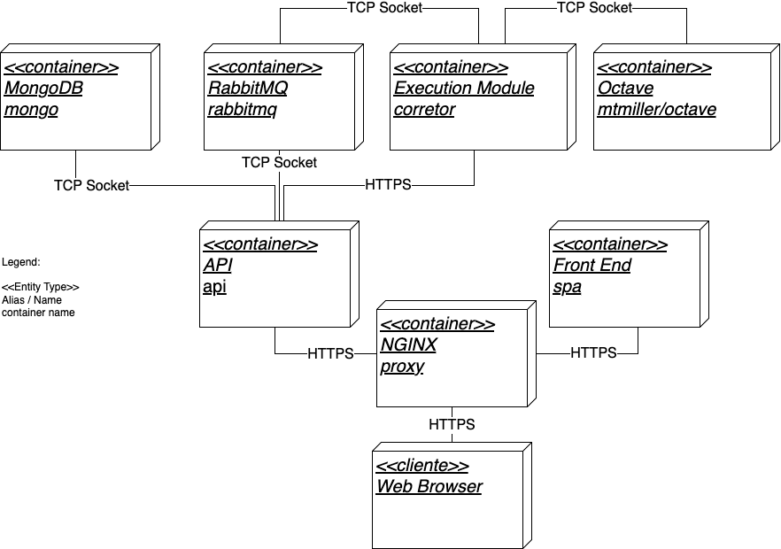

# Octave Correction Tool


## Table of Contents

- [Overview](#overview)
- [Features](#features)
- [Architecture](#architecture)
- [Technologies Used](#technologies-used)
- [Installation](#installation)
- [Usage](#usage)
- [Contributing](#contributing)
- [License](#license)
- [Contact](#contact)

## Overview

**Octave Correction Tool** was developed as part of my final bachelor’s thesis.

For more information, check the my thesis in [portuguese](https://drive.google.com/file/d/1Vr_3f_ZE9s7d8NMzGPQDJvieRiAMbspm/view?usp=drive_link) or [english](https://drive.google.com/file/d/1cTfLssH6WCpqBk-HyzWc_J3tumObsP7Y/view?usp=drive_link)

> Note: The english version was translated using an online tool, I recommend checking the original document - in portuguese - if possible.

It is a platform designed to assist professors in the subject of Numeric Calculus by automating the evaluation of student assignments, currently only supporting Octave assigments. Hosted within a monorepo structure, the repository comprises several interconnected services that streamline the submission, execution, and grading of numerical methods implemented by students in Octave.

Traditional methods of manual code evaluation are time-consuming and error-prone, especially in large classes where hundreds or thousands of executions may be required. This platform addresses these challenges by offering automated batch processing of student-submitted algorithms, providing rapid feedback and reducing the grading workload for educators.

## Features

- **Automatic Execution of Algorithms:** Automatically execute student submissions as they're uploaded, ensuring consistency and efficiency.
- **Scalable Architecture:** Capable of handling large volumes of submissions by executing exercises in parallel.
- **User Management:** Manage classes, exercises, and test cases with ease.
- **Automated Feedback:** Provide students with immediate feedback based on predefined test cases.
- **Secure Execution Environment:** Isolated containers ensure safe execution of untrusted student code.
- **Intuitive Interface:** User-friendly front-end for both professors and students to interact with the platform.

## Architecture



The system is built as a monorepo containing several microservices, each responsible for distinct functionalities:

1. **Database:** Utilizes MongoDB for storing user data, assignments, test cases, and execution results.
2. **Message Broker:** RabbitMQ handles asynchronous communication between services, ensuring reliable task processing.
3. **Execution Engine:** Manages the execution of student-submitted Octave code within isolated Docker containers.
4. **Octave** Octave container where the student's code will be run. A clear container with octave-cli, and a binded volume with student data.
5. **API** A Express API which handles most of the logic in the system. Exposes endpoints for the professor and student.
6. **Frontend:** A web-based interface developed using Vue.js, allowing users to interact with the platform seamlessly.
7. **NGINX:** Serves as the central communication hub, handling requests from the client and coordinating between the API and the Front End.

## Technologies Used

- **Frontend:** Vue.js, Vuetify
- **Backend:** Node.js, Express
- **Database:** MongoDB
- **Containerization:** Docker, Docker Compose
- **Messaging:** RabbitMQ
- **Execution Environment:** GNU Octave
- **Web Server:** NGINX
- **Authentication:** JSON Web Tokens (JWT)

## Installation

### Prerequisites

- [Docker](https://www.docker.com/get-started) installed on your machine
- [Docker Compose](https://docs.docker.com/compose/install/) installed

### Steps

1. **Clone the Repository**

   ```bash
   git clone https://github.com/joaoaugustogrobe/CorrectionTool2.0.git
   cd CorrectionTool2.0
   ```

2. **Configure Environment Variables**

   Create a `.env` file in the root directory and populate it based on the `.env.example` provided.

   ```bash
   cp .env.example .env
   ```

   Edit the `.env` file to set your configuration parameters, such as database credentials, API keys, and other necessary settings.

3. **Build and Deploy Services**

   Use Docker Compose to build and start all services.

   ```bash
   docker-compose up -f docker-compose-prod.yml --build
   ```

   This command will set up the frontend, backend API, database, message broker, and execution engine.

4. **Access the Application**

   Once all services are up and running, navigate to `http://localhost:3000` in your web browser to access the platform.

## Usage

### For Professors

1. **Login/Sign Up:** Access the platform using your credentials.
2. **Manage Classes:** Create and manage classes, enroll students, and assign courses.
3. **Create Exercises:** Define new exercises by specifying the problem statement, function signatures, and associated test cases.
4. **Define Test Cases:** Set up both public and private test cases with specific input parameters and expected outputs.
5. **Review Submissions:** Monitor student submissions, review execution results, and provide feedback or override automatic grades as necessary.


### For Students

1. **Login/Sign Up:** Access the platform using your credentials.
2. **Enroll in Classes:** Join available classes or be enrolled by your professor.
3. **Download Templates:** Access exercise templates provided by your professor to ensure proper submission format.
4. **Submit Assignments:** Upload your Octave scripts for evaluation.
5. **Receive Feedback:** View automated test results and feedback to improve your solutions.


## Contributing

Contributions are welcome! Please follow these steps to contribute:

1. **Fork the Repository**

   Click the [Fork](https://github.com/joaoaugustogrobe/CorrectionTool2.0.git) button on the repository page.

2. **Create a Feature Branch**

   ```bash
   git checkout -b feature/YourFeatureName
   ```

3. **Commit Your Changes**

   ```bash
   git commit -m "Add some feature"
   ```

4. **Push to the Branch**

   ```bash
   git push origin feature/YourFeatureName
   ```

5. **Open a Pull Request**

   Navigate to the original repository and click on "Compare & pull request."

Please ensure your contributions adhere to the project's code of conduct and include relevant tests and documentation where applicable.

## License

This project is licensed under the MIT License - see the [LICENSE](LICENSE) file for details.

## Contact

For any inquiries or support, please contact:

- **Email:** contato@joaocastilho.com.br
- **LinkedIn:** [João Castilho](https://www.linkedin.com/in/joao-augusto-grobe-castilho/)
